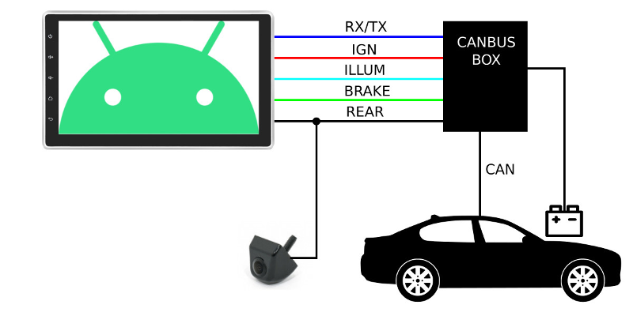
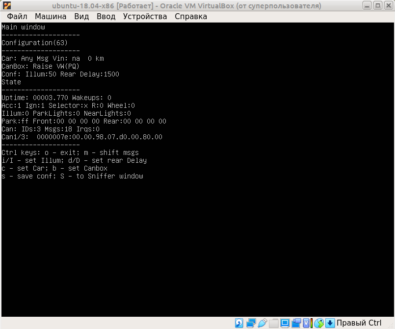
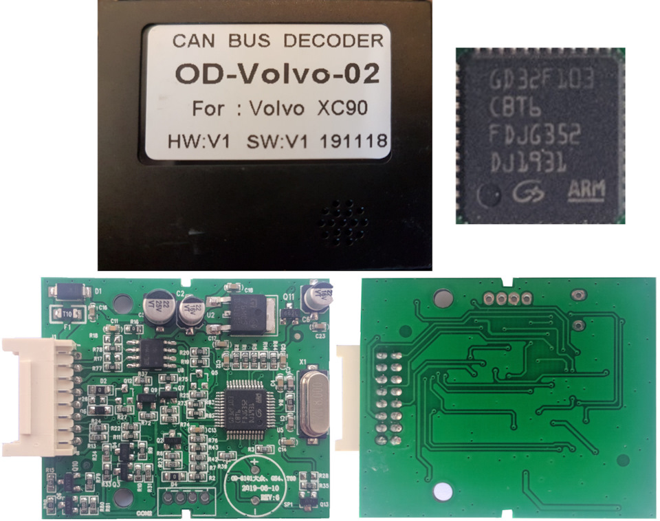
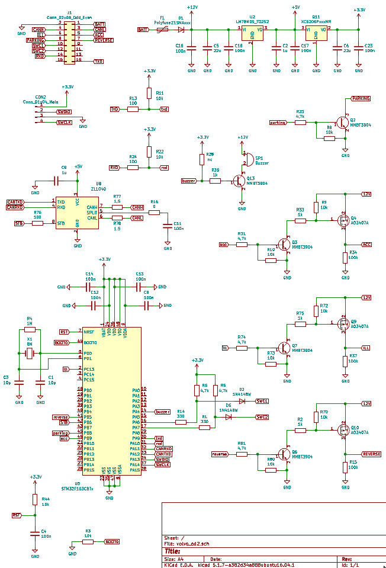
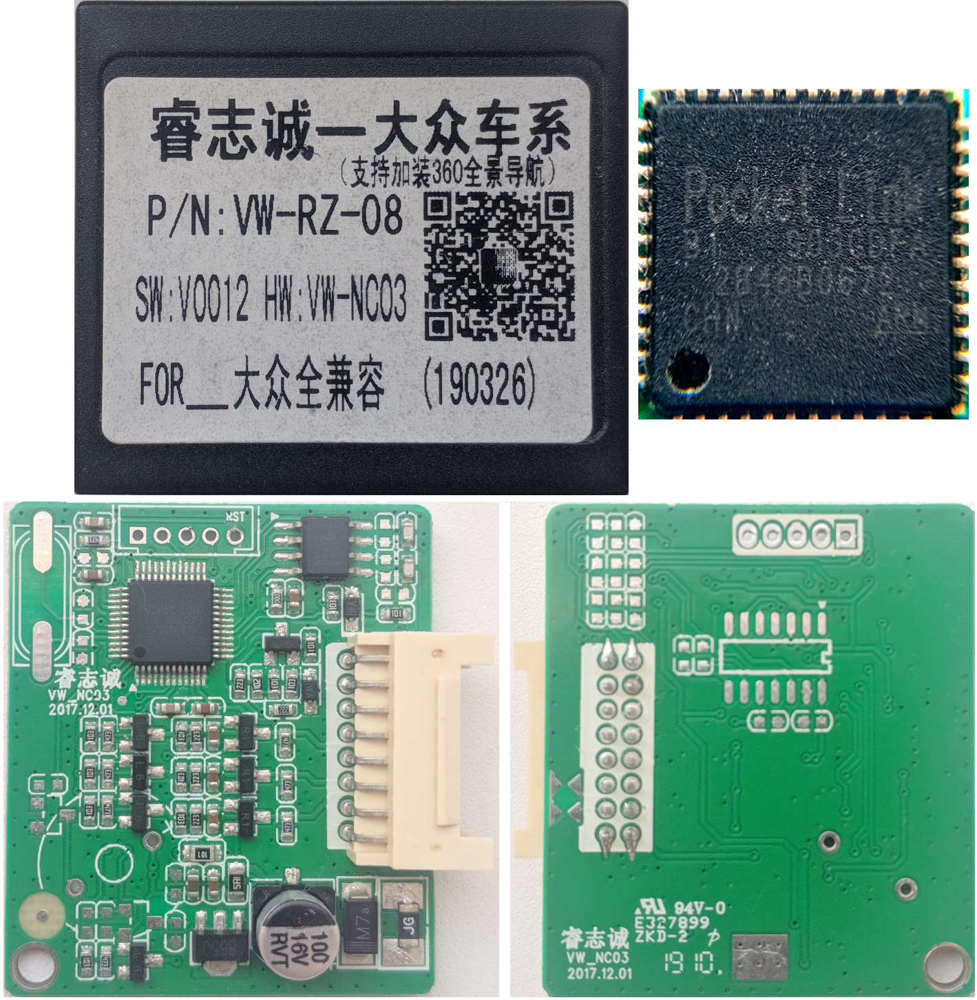
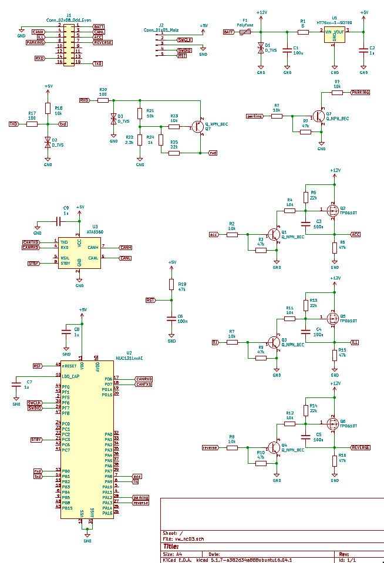

# canbox
Firmware for some canbus boxes which are available on aliexpress.

A canbus box is a device that allows you to connect your Android device to a CAN bus

General canbus box features:
- turns on power for android when the ignition is turned on
- turns on the power for the rear view camera
- toggle backlight for android
- displaying the state of the car on the android screen(open doors, parking sensors, etc.)

Since the adapter supports several car models and protocols, the adapter must first be configured for a specific car. To configure, the adapter must be connected to the Rx and TX lines at 38400 speed using any terminal program (putty, hyperterminal, minicom ...)
Changing the configuration of the adapter is possible in debug mode. Switching to debug mode occurs when you press the corresponding keys on the keyboard:
- OOOOOOOOOOOOO switch to debug mode (must send at least 10 O characters in 1 second)
- o switch to normal mode
- b selection of the emulated protocol from the list Raise VW(PQ), Raise VW(MQB), Oudi BMW(Nbt Evo, HiWorld VW(MQB)
- c selection of a car from the list FL2 2007MY, FL2 2013MY, XC90 2007MY
- I increase the backlight level threshold
- i decrease the backlight level threshold
- D increase camera turn off delay
- d decrease camera turn off delay
- m selection of active CAN message
- s save configuration

You can also check the firmware using the emulator qemu. Below is the debug window of the firmware launched in the emulator qemu with help command "make run_qemu"

[More info](https://www.drive2.ru/b/599820152787190466/)

